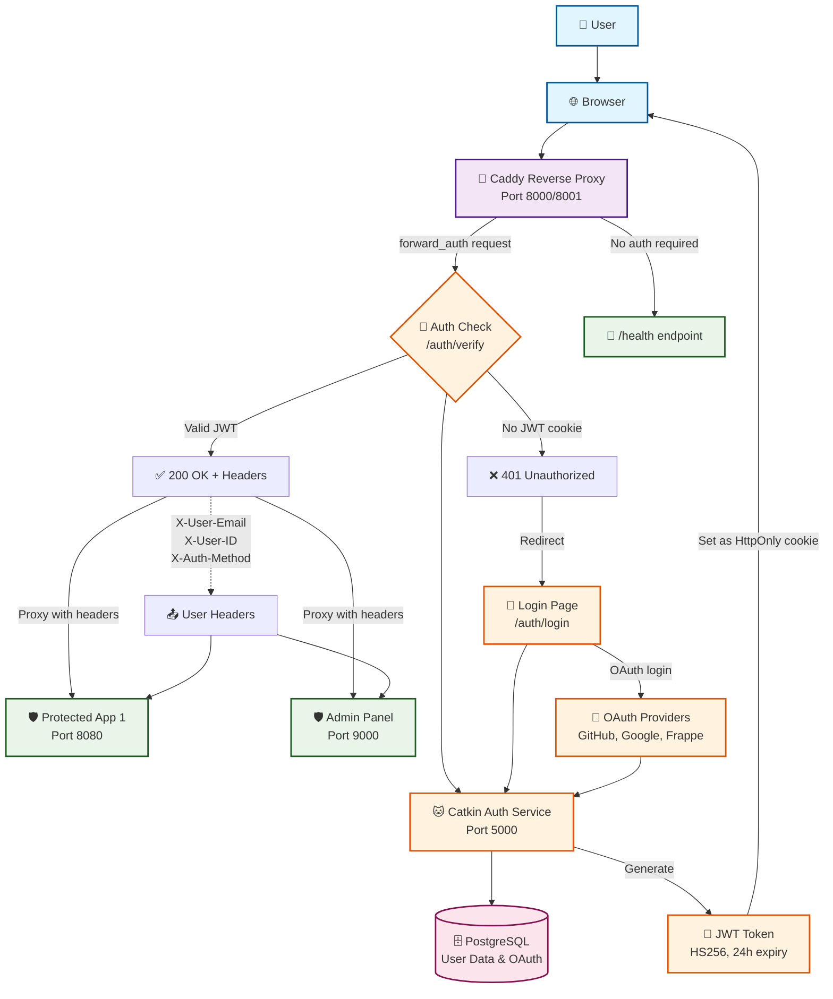
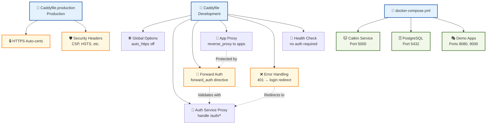
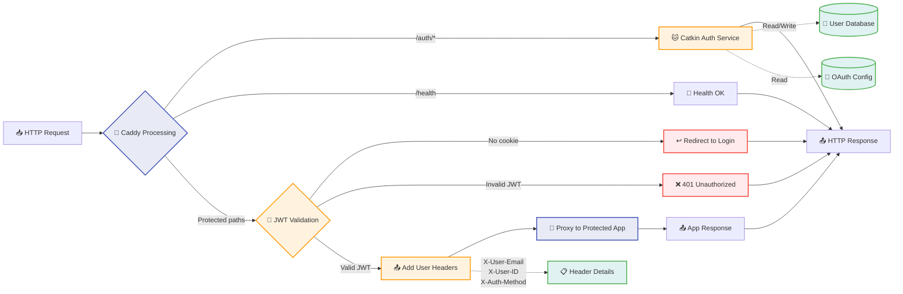
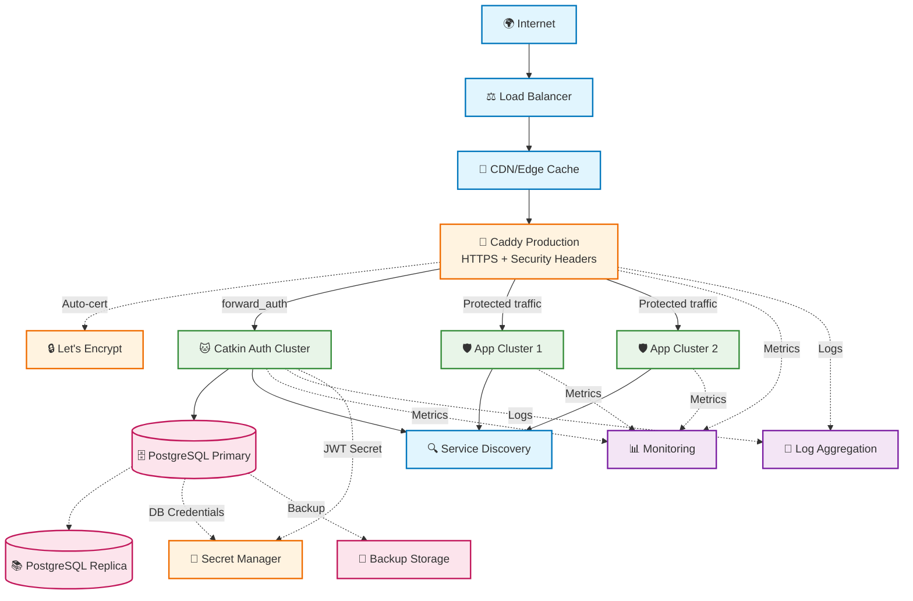
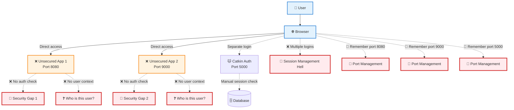
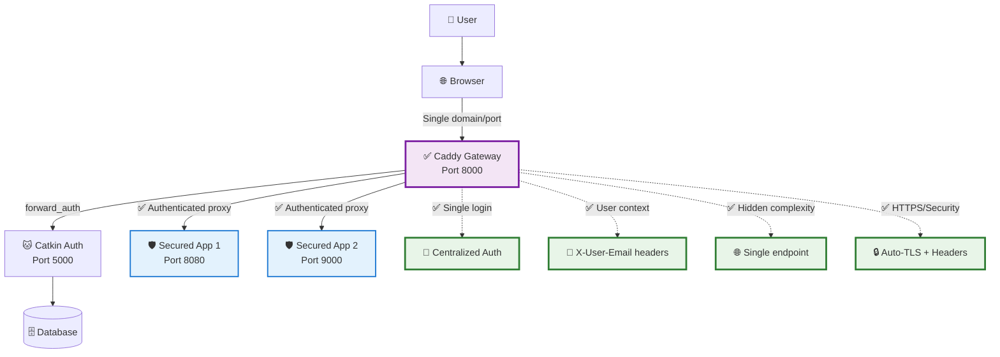
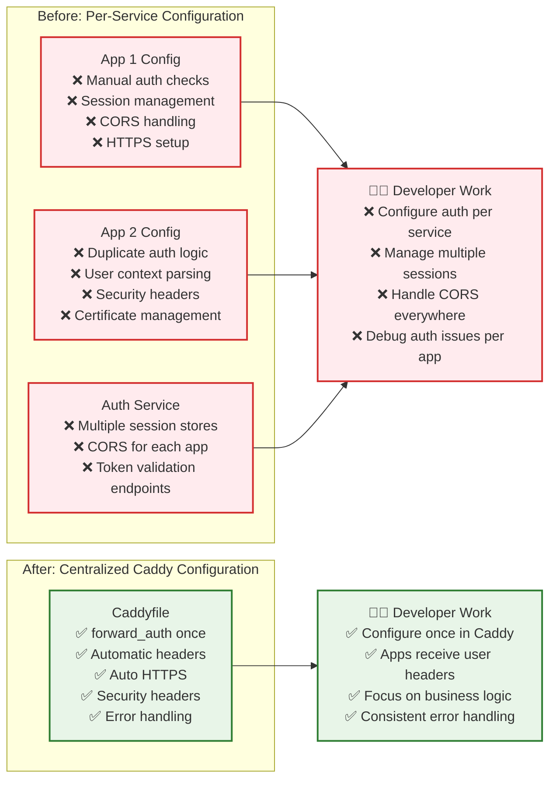

# Caddy JWT Authentication System Architecture

## System Overview Diagram

## Configuration Flow

## Data Flow Architecture

## Production Deployment Architecture

---

### Before Caddy: Unsecured Service Architecture

### After Caddy: Unified Secure Gateway

### Configuration Complexity Reduction

